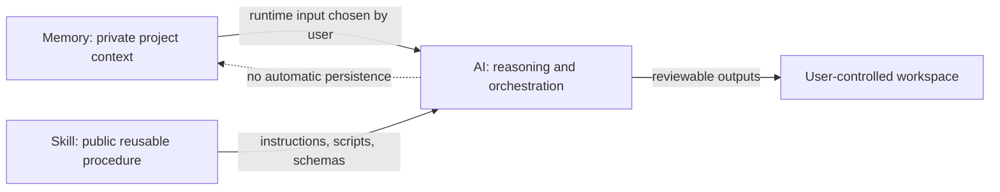
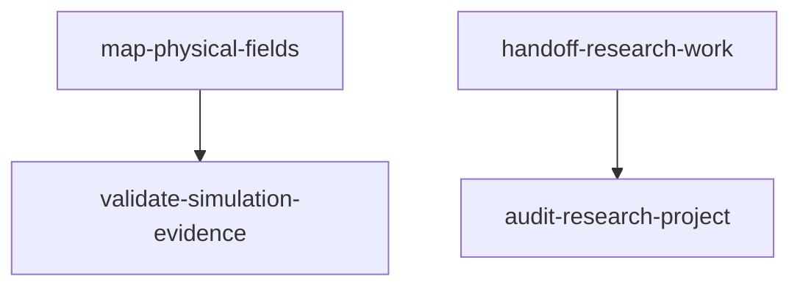

# Architecture

Research AI Skills uses a strict three-layer boundary: Memory, Skill, and AI. Only the Skill layer belongs in this repository.

## 1. Memory Layer

Memory contains project-specific facts: research decisions, unpublished findings, real paths, data provenance, working preferences, and continuity notes. It may be valuable at runtime, but it is private by default and is never packaged as a Skill resource.

The repository therefore contains no Memory directory, memory export, canonical project record, paper, model, dataset, or project snapshot. When a workflow needs such context, the user supplies the minimum necessary input at runtime and controls where the resulting artifacts are stored.

## 2. Skill Layer

A Skill is the stable, reusable procedure. It defines triggering metadata, input contracts, bounded workflows, failure behavior, and output contracts. A Skill may include:

- `SKILL.md` for instructions and boundaries;
- `agents/openai.yaml` for interface metadata;
- `references/` for detailed contracts and policies;
- `scripts/` for deterministic standard-library operations;
- `templates/` for empty or synthetic starting documents.

Skills must not contain remembered conclusions, unpublished evidence, real project locators, credentials, or claims copied from a specific research project. Scripts operate on caller-supplied data and preserve the distinction between recorded evidence and scientific judgment.

## 3. AI Layer

The AI selects a Skill, reads only the resources needed for the request, and applies the procedure to runtime inputs. It is responsible for respecting the Skill's authority boundaries, surfacing failures, and routing scientific decisions to a human reviewer.

The AI is not itself a source of project truth. It must not invent thresholds, upgrade missing evidence, infer scientific authority from filenames, or write runtime context back into the public Skill library.

## Dependency Model

Dependencies point from the caller to the required lower-level Skill. Foundation dependencies must remain acyclic. `audit-research-project` is read-only and never calls handoff in reverse; `map-physical-fields` delegates evidence aggregation to `validate-simulation-evidence` instead of defining a competing status model.

## Contract and Data Flow

1. The user selects runtime inputs and acceptance criteria.
2. The AI loads the relevant Skill and its declared dependencies.
3. Scripts validate or transform inputs without embedding them in the library.
4. Outputs use relative references and versioned schemas.
5. The user reviews scientific meaning and decides whether outputs may be retained or shared.

This separation makes the public repository reusable while keeping research state private and project authority with the researcher.
